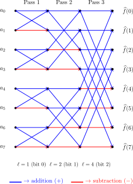

# LibFWHT

[](https://www.gnu.org/licenses/gpl-3.0)

High-performance C99 library for computing the Fast Walsh-Hadamard Transform (FWHT), a fundamental tool in cryptanalysis and Boolean function analysis. The library provides multiple backend implementations (vectorized single-threaded CPU, OpenMP, and CUDA) with automatic selection based on problem size, offering optimal performance across different hardware configurations.

<p align="center">
  
</p>

## Key Features

- **Multiple Backends**: Vectorized CPU (AVX2/SSE2/NEON), OpenMP multi-threading, CUDA GPU acceleration
- **Multi-Precision GPU**: int32, fp64, fp32 (25× faster), fp16 Tensor Cores (35× faster) with automatic precision selection
- **Automatic Backend Selection**: Chooses optimal implementation based on problem size and available hardware
- **Memory Efficient**: In-place algorithm with `O(log n)` stack space, cache-aligned allocations
- **High Performance**: 
  - CPU: Up to 5 GOps/s with SIMD (AVX2/NEON)
  - OpenMP: Near-linear scaling on multi-core systems
  - GPU: Up to 738 GOps/s on RTX 4090 (fp16 Tensor Cores)
  - Persistent GPU contexts eliminate malloc/free overhead (5-10× speedup)
- **Vectorized Batch Processing**: SIMD-accelerated batch API processes multiple transforms simultaneously (ideal for cryptanalysis)
- **Bit-packed Boolean WHT**: High-level API to compute WHT from 1-bit packed truth tables (32× memory savings)
- **Overflow Safety**: Optional runtime overflow detection for int32 transforms with `fwht_i32_safe()`
- **Flexible API**: In-place transforms, out-of-place helpers, batch processing, Boolean function utilities, device-pointer APIs
- **Production Ready**: Comprehensive test suite, numerical stability guarantees, precision warnings, command-line tool included
- **Easy Integration**: C99 standard, minimal dependencies, Python bindings available via PyPI with DLPack support

## Algorithm

The Fast Walsh-Hadamard Transform computes the Walsh spectrum of k-variable Boolean functions using butterfly operations:

- **Time complexity**: `O(n log n) = O(k × 2^k)` for truth tables of size `n = 2^k`
- **Space complexity**: `O(log n)` recursion stack (in-place, no temporary buffers)
- **Divide-and-conquer**: Recursive with cache-efficient base cases (512-element cutoff fits in L1)
- **Multi-backend architecture**:
  - **CPU**: SIMD vectorization (AVX2/SSE2/NEON auto-detected), software prefetching, cache-aligned allocations
  - **OpenMP**: Task-based recursive parallelism for multi-core scaling
  - **GPU**: Persistent buffers, async transfers, shared memory kernels
  - **Auto-tuning**: Runtime backend selection based on problem size and hardware

## Build and Install

- Prerequisites: C99 compiler, `make`; optional OpenMP toolchain; optional CUDA toolkit when GPU support is desired
- Default build (library + regression tests): `make`
- Focused targets: `make lib`, `make test`, `make test-gpu`, `make openmp`, `make NO_CUDA=1`
- Installation (optional): `sudo make install` installs headers and libraries into `/usr/local`

Build outputs are placed in `build/` (executables) and `lib/` (libraries).

## Library Usage

```c
#include <fwht.h>
#include <stdio.h>

int main(void) {
    /* Boolean truth table: 0 → +1, 1 → -1 */
    int32_t data[8] = {1, -1, -1, 1, -1, 1, 1, -1};

    fwht_status_t status = fwht_i32(data, 8);
    if (status != FWHT_SUCCESS) {
        fprintf(stderr, "%s\n", fwht_error_string(status));
        return 1;
    }

    printf("WHT[0] = %d\n", data[0]);
    return 0;
}
```

Compile with `gcc example.c -lfwht -lm` (or link directly against `libfwht.a` in `lib/`).

### Core API Highlights

- `fwht_i32`: in-place transform for `int32_t` data (default entry point for Boolean spectra)
  - Safe for all n if `|input[i]| ≤ 1`; general rule: `n × max(|input|) < 2^31`
- `fwht_i32_safe`: overflow-safe variant with runtime detection (returns `FWHT_ERROR_OVERFLOW` on overflow)
  - ~5-10% slower but guarantees detection of integer overflow
  - Use when input magnitudes are large or unknown
- `fwht_f64`: in-place transform for `double` data when fractional coefficients matter
  - Relative error typically `< log₂(n) × 2.22e-16` (e.g., `< 2e-15` for n=2^20)
- `fwht_i8`: in-place transform for `int8_t` data to minimize memory footprint
- `fwht_boolean_packed`: compute WHT directly from a bit-packed Boolean truth table (`uint64` words); ideal for S-box analysis
- `fwht_boolean_batch`: batch processing of multiple bit-packed Boolean functions (vectorial S-box components)
  - **Note:** Only safe for `n ≤ 64` with `|input| = 1` (watch for overflow)
- `fwht_i32_backend`, `fwht_f64_backend`: same transforms with explicit backend selection (`AUTO`, `CPU`, `CPU_SAFE`, `OPENMP`, `GPU`)
- `fwht_compute_i32`, `fwht_compute_f64`: out-of-place transforms returning cache-aligned memory
  - **Important:** Must use `fwht_free()` instead of `free()` to deallocate results
- `fwht_from_bool`: convert a Boolean truth table to signed Walsh coefficients before transforming
- `fwht_correlations`: normalize Walsh coefficients to per-mask correlation values
- `fwht_has_gpu`, `fwht_has_openmp`, `fwht_backend_name`: query runtime capabilities and selected backend
- `fwht_gpu_get_device_name`, `fwht_gpu_get_compute_capability`, `fwht_gpu_get_sm_count`: query GPU architecture details

### GPU Batch Processing and Multi-Precision Support (CUDA)

The library provides comprehensive GPU acceleration with multiple precision modes:

```c
#ifdef USE_CUDA
/* Multi-precision batch processing */
size_t n = 1024;
size_t batch_size = 100;

/* Integer precision (bit-exact) */
int32_t* data_i32 = malloc(n * batch_size * sizeof(int32_t));
fwht_batch_i32_cuda(data_i32, n, batch_size);

/* Float64 precision (cryptographic, ~1e-15 error) */
double* data_f64 = malloc(n * batch_size * sizeof(double));
fwht_batch_f64_cuda(data_f64, n, batch_size);

/* Float32 precision (balanced, 25× faster than fp64) */
float* data_f32 = malloc(n * batch_size * sizeof(float));
fwht_batch_f32_cuda(data_f32, n, batch_size);

/* FP16 Tensor Cores (ML, 35× faster, requires SM 7.0+) */
uint16_t* d_in_fp16;   /* Device pointer to fp16 data */
uint16_t* d_out_fp16;  /* Device pointer for results */
cudaMalloc(&d_in_fp16, n * batch_size * sizeof(uint16_t));
cudaMalloc(&d_out_fp16, n * batch_size * sizeof(uint16_t));
/* ... copy data to device ... */
int status = fwht_batch_f16_cuda_device(d_in_fp16, d_out_fp16, n, batch_size);
#endif
```

**Device-pointer APIs** for zero-copy GPU-resident buffers (no H2D/D2H transfers):
- `fwht_batch_i32_cuda_device()` - int32 on device
- `fwht_batch_f64_cuda_device()` - float64 on device
- `fwht_batch_f32_cuda_device()` - float32 on device (25× faster)
- `fwht_batch_f16_cuda_device()` - float16 Tensor Cores (35× faster)

**FP16 Tensor Core Notes:**
- Requires NVIDIA GPU with SM 7.0+ (Volta, Turing, Ampere, Ada, Hopper)
- Provides 25-36× speedup vs fp64 with small precision loss (~12% of results differ by ±1-4)
- Ideal for ML training/inference, NOT for cryptanalysis requiring bit-exact results
- Automatic runtime warning on first use (suppressible via `FWHT_SILENCE_FP16_WARNING=1`)

### GPU Context API (Persistent Memory)

For applications computing many WHTs repeatedly, persistent GPU contexts eliminate malloc/free overhead:

```c
#ifdef USE_CUDA
/* Create context with max transform size and batch size */
fwht_gpu_context_t* ctx = fwht_gpu_context_create(1024, 100);

/* Reuse pre-allocated GPU memory for many transforms */
for (int i = 0; i < 10000; i++) {
    fwht_gpu_context_compute_i32(ctx, data, 256, 1);
}

/* Clean up */
fwht_gpu_context_destroy(ctx);
#endif
```

**Performance benefit**: 5-10× speedup for cryptanalysis workloads with many small transforms.

### GPU Configuration and Tuning

```c
#ifdef USE_CUDA
/* Query GPU capabilities */
if (fwht_has_gpu()) {
    printf("GPU: %s\n", fwht_gpu_get_device_name());
    printf("Compute Capability: SM %d.%d\n", 
           fwht_gpu_get_compute_capability() / 10,
           fwht_gpu_get_compute_capability() % 10);
    printf("Streaming Multiprocessors: %d\n", fwht_gpu_get_sm_count());
}

/* Optional performance tuning */
fwht_gpu_set_block_size(256);         /* Override auto-tuned block size */
fwht_gpu_set_multi_shuffle(true);     /* Enable warp-shuffle optimization */
fwht_gpu_set_chunked(true);           /* Enable chunked kernel for large n */
fwht_gpu_set_profiling(true);         /* Collect H2D/kernel/D2H timing */

/* Get profiling metrics after a transform */
fwht_gpu_metrics_t metrics = fwht_gpu_get_last_metrics();
printf("Kernel time: %.3f ms\n", metrics.kernel_ms);
#endif
```

### Vectorized Batch Processing

For cryptanalysis workloads that require processing hundreds or thousands of small transforms (e.g., S-box analysis), the batch API processes multiple transforms simultaneously using SIMD instructions:

```c
/* Analyze 1000 S-box truth tables (each size 256) */
int32_t** sboxes = malloc(1000 * sizeof(int32_t*));
for (int i = 0; i < 1000; i++) {
    sboxes[i] = malloc(256 * sizeof(int32_t));
    /* Fill with S-box truth table data */
}

/* Process all transforms in parallel with SIMD */
fwht_i32_batch(sboxes, 256, 1000);

/* Cleanup */
for (int i = 0; i < 1000; i++) free(sboxes[i]);
free(sboxes);
```

**Implementation:**
- **AVX2** (x86-64): Processes 8 int32 or 4 double transforms simultaneously
- **NEON** (ARM): Processes 4 int32 or 2 double transforms simultaneously
- **Transpose algorithm**: Inspired by Intel MKL FFT batch processing
- **Expected speedup**: 3-5× for small transforms (N ≤ 256) compared to sequential processing

**Perfect for:**
- Cryptographic S-box analysis (thousands of small truth tables)
- Boolean function enumeration and classification
- Correlation-immunity testing across multiple functions

### Bit-packed Boolean Functions

When your Boolean function is stored in a bitset (1 bit per entry), use the packed API for memory efficiency and speed:

```c
/* Truth table [0,1,1,0,1,0,0,1] → bits 1,2,4,7 set → 0x96 */
uint64_t packed = 0x96ULL;
int32_t wht[8];
fwht_status_t st = fwht_boolean_packed(&packed, wht, 8);
```

See `examples/example_boolean_packed.c` for a complete sample, including packing helpers and verification against the unpacked API.

## Python Package

Python bindings are available via PyPI for seamless NumPy integration:

```bash
# Install from PyPI
pip install pyfwht

# Enable CUDA support (requires CUDA toolkit)
USE_CUDA=1 pip install pyfwht --no-binary :all:
```

### Quick Example

```python
import numpy as np
import pyfwht as fwht

# Boolean function analysis
truth_table = np.array([0, 1, 1, 0, 1, 0, 0, 1], dtype=np.uint8)
wht_coeffs = fwht.from_bool(truth_table, signed=True)
print(wht_coeffs)

# Automatic backend selection (CPU/OpenMP/GPU)
data = np.random.randint(-100, 100, size=2**20, dtype=np.int32)
fwht.transform(data)  # In-place, auto-selects best backend
```

**Features:**

- Zero-copy NumPy integration
- Automatic backend selection (CPU SIMD, OpenMP, CUDA)
- Multi-precision GPU support:
  - fp64 (cryptographic precision, ~1e-15 error)
  - fp32 (balanced mode, ~1e-6 error, 25× faster than fp64)
  - fp16 (ML/Tensor Cores, ~1e-3 error, 36× faster than fp64)
- Support for `int8`, `int32`, and `float64` data types
- Boolean function utilities for cryptanalysis
- GPU acceleration: up to **738 GOps/s** on RTX 4090 (fp16 Tensor Core mode)
- DLPack support for zero-copy PyTorch/JAX integration

See [`python/README.md`](python/README.md) for complete documentation, API reference, and FP16 precision characteristics.

## Command-Line Interface

A CLI is provided for quick transforms without writing C code.

### Build

```
make cli
```

The executable is written to `build/fwht_cli`.

### Usage

```
./build/fwht_cli [--input file | --values list] [options]
```

Key options:

- `--input <path>`: read whitespace/comma separated tokens from a file
- `--values <list>`: inline comma/space separated integers (e.g. `--values 0,1,1,0`)
- `--input-format bool|signed`: interpret tokens as 0/1 (default) or signed integers
- `--backend auto|cpu|openmp|gpu`: choose backend (default `auto`)
- `--normalize`: print coefficients divided by `sqrt(n)`
- `--precision <digits>`: decimal places for normalized output (default 6)
- `--no-index`: omit the index column (useful for piping downstream)
- `--quiet`: suppress header metadata

Examples:

```
./build/fwht_cli --values 0,1,1,0,1,0,0,1 --normalize
./build/fwht_cli --input data/walsh.txt --backend gpu
```

Exit status `0` indicates success; non-zero signals parse or transform errors.

## Testing and Tooling

- `make test`: CPU regression suite (mathematical properties, edge cases, API coverage)
- `make test-gpu`: CUDA regression and consistency tests (skips cleanly if CUDA is unavailable)
- `make bench`: build benchmarking utility at `build/fwht_bench`

Always run these targets from the `libfwht` root so generated artefacts remain in the build tree.

## Examples

Build and run example programs:

```
make examples
# or
make example   # alias

./examples/example_basic
./examples/example_boolean_packed
```

The bit-packed example shows how to pack a Boolean truth table into `uint64_t` words and compute the WHT directly via `fwht_boolean_packed`.

## Benchmark Reference

Measurements gathered with `./build/fwht_bench` using `--repeats=10` (GPU runs include `--warmup=1`).

### Reproduction Commands

```bash
# Build library with OpenMP and benchmark (run from the libfwht root)
make openmp bench

# CPU benchmarks (single-threaded and multi-threaded)
./build/fwht_bench \
    --backend=cpu \
    --sizes=16777216,33554432,67108864,134217728,268435456,1073741824 \
    --repeats=10

# GPU benchmarks (rebuild with CUDA support first)
make clean && make bench
./build/fwht_bench \
  --backend=gpu \
  --sizes=16777216,33554432,67108864,134217728,268435456,1073741824 \
  --repeats=10 \
  --warmup=1 \
  --profile \
  --pinned \
  --use-context \
  --multi-shuffle=on
```

GPU feature flags:

- `--profile`: report H2D / Kernel / D2H timing breakdowns (also enabled via FWHT_GPU_PROFILE=1)
- `--pinned`: allocate page-locked host buffers for faster transfers
- `--use-context`: reuse a persistent GPU context (avoid cudaMalloc/cudaFree per run)
- `--device-resident`: keep data on device and measure kernel-only time (no H2D/D2H)
- `--multi-shuffle=on|off`: force enable/disable warp multi-shuffle optimization for medium sizes

### CPU Performance

#### Apple M4 (macOS 15.7.1)

**System Configuration:**

- CPU: Apple M4 (10 cores, ARM NEON)
- Memory: 24 GB unified

| Mode                    | Size | Mean (ms) | StdDev (ms) |
| :---------------------- | ---: | --------: | ----------: |
| cpu (single-threaded)   | 2^24 |      27.4 |         1.0 |
|                         | 2^25 |      57.6 |         0.8 |
|                         | 2^26 |     123.4 |         2.8 |
|                         | 2^27 |     262.7 |        16.3 |
|                         | 2^28 |     547.3 |        17.7 |
|                         | 2^30 |   2,417.8 |       147.4 |
| openmp (multi-threaded) | 2^24 |      15.3 |         0.5 |
|                         | 2^25 |      27.8 |         2.0 |
|                         | 2^26 |      56.8 |         4.5 |
|                         | 2^27 |     115.3 |         4.6 |
|                         | 2^28 |     248.6 |         8.3 |
|                         | 2^30 |   1,119.7 |        35.9 |

#### AMD EPYC 9254 (Linux)

**System Configuration:**

- CPU: AMD EPYC 9254 24-Core Processor (48 threads, x86_64 AVX2)
- Memory: 377 GB

| Mode                    | Size | Mean (ms) | StdDev (ms) |
| :---------------------- | ---: | --------: | ----------: |
| cpu (single-threaded)   | 2^24 |      56.1 |         0.0 |
|                         | 2^25 |     116.2 |         0.1 |
|                         | 2^26 |     240.9 |         0.1 |
|                         | 2^27 |     589.0 |         0.1 |
|                         | 2^28 |   1,393.2 |         0.3 |
|                         | 2^30 |   7,286.1 |         1.1 |
| openmp (multi-threaded) | 2^24 |      29.5 |         5.8 |
|                         | 2^25 |      40.8 |         7.3 |
|                         | 2^26 |      68.6 |         9.4 |
|                         | 2^27 |     221.6 |         8.6 |
|                         | 2^28 |     514.9 |         7.0 |
|                         | 2^30 |   2,235.8 |       140.0 |

### GPU Performance (NVIDIA A30, Linux)

**System Configuration:**

- GPU: NVIDIA A30 (CUDA 13.0 runtime, driver 580.95.05, nvcc 12.6.68)
- Host CPU: Dual AMD EPYC 9254 (48 hardware threads)
- System RAM: 377 GB, GPU RAM: 24 GB HBM2

**Note:** GOps/s (Giga Operations per second) measures throughput using the formula: `(N × log₂(N)) / time`, where N is the transform size. This counts the number of add/subtract operations in the butterfly algorithm.

**Integer Precision (int32, batch=1):**

| Size | Mean (ms) | StdDev (ms) | GOps/s |
| ---: | --------: | ----------: | -----: |
| 2^24 |      10.7 |         0.0 |  37.63 |
| 2^25 |      22.8 |         1.0 |  36.79 |
| 2^26 |      47.3 |         0.1 |  36.89 |
| 2^27 |      86.9 |         3.5 |  41.70 |
| 2^28 |     171.9 |         0.1 |  43.72 |
| 2^30 |     714.6 |         5.6 |  45.08 |

### GPU Performance (NVIDIA H100, Linux)

**System Configuration:**

- GPU: NVIDIA H100 80GB HBM3 (CUDA 12.6 runtime, driver 580.95.05, nvcc 12.6.68)
- Host CPU: AMD EPYC 9334 (64 threads)
- System RAM: 377 GB, GPU RAM: 80 GB HBM3
- Compute Capability: SM 9.0 (Hopper), 132 SMs, 32 SMEM banks

**Integer Precision (int32, batch=1):**

| Size | Mean (ms) | StdDev (ms) | GOps/s |
| ---: | --------: | ----------: | -----: |
| 2^24 |      6.79 |        0.05 |  59.27 |
| 2^25 |     12.59 |        0.03 |  66.62 |
| 2^26 |     24.35 |        0.09 |  71.65 |
| 2^27 |     48.07 |        0.12 |  75.39 |
| 2^28 |     95.62 |        0.08 |  78.60 |
| 2^30 |    385.34 |        0.06 |  83.59 |

**Performance Comparison (H100 vs A30):**
- H100 provides **1.58× speedup** for 2^24 (6.79 ms vs 10.7 ms)
- H100 provides **1.85× speedup** for 2^30 (385.34 ms vs 714.6 ms)
- Peak throughput: **83.59 GOps/s** on H100 vs **45.08 GOps/s** on A30 (for 2^30)
- H100 achieves **1.85× higher throughput** due to HBM3 memory and Hopper architecture (SM 9.0)
- Both GPUs show consistent low-variance performance (< 0.1 ms stddev) typical of datacenter HBM GPUs

### GPU Multi-Precision Performance (NVIDIA RTX 4090)

**System Configuration:**

- GPU: NVIDIA GeForce RTX 4090 (SM 8.9, 128 SMs, 24 GB GDDR6X)
- Host CPU: AMD EPYC 9334 (64 threads)
- CUDA: Version 12.4
- Library Version: 1.2.0+

**Performance Comparison (n=4096, batch=100):**

| Precision | Time (ms) | GOps/s | Speedup vs fp64 | Accuracy        | Use Case                    |
| --------- | --------: | -----: | --------------: | --------------- | --------------------------- |
| fp64      |     20.00 |  20.65 |           1.00× | Bit-exact       | Cryptanalysis, exact math   |
| fp32      |      0.66 | 625.40 |          30.28× | ~1e-6 error     | Balanced performance        |
| fp16 (TC) |      0.56 | 738.93 |          35.78× | ~1e-3, ±1-4 int | Machine learning, inference |

**Key Observations:**
- fp32 provides 30× speedup with excellent precision for most applications
- fp16 Tensor Cores achieve 738 GOps/s (91% of Meta's fast-hadamard-transform)
- fp16 accuracy: 87.78% bit-exact, 12.22% with small differences (±1-4 integers)
- All precisions achieve perfect accuracy when compared to precision-matched CPU references

## Performance Insights

**Memory-Bandwidth Bound Algorithm:**

- FWHT performance depends on memory subsystem bandwidth, not FLOPS
- Each element is accessed log₂(n) times with irregular stride patterns (low arithmetic intensity)
- CPU optimizations focus on cache efficiency and SIMD vectorization

**Backend Selection Guidelines:**

- **CPU single-threaded**: Small transforms (n < 1M) or when latency matters
- **OpenMP multi-threaded**: Medium to large transforms on multi-core systems (near-linear scaling observed)
- **GPU**: Large single transforms (n ≥ 64M) or batch operations (10+ transforms)
  - HBM-based datacenter GPUs (A30, A100, H100) provide consistent low-variance performance
    - A30 (HBM2): 37-45 GOps/s, excellent for production workloads
    - H100 (HBM3): 59-84 GOps/s, 1.85× faster than A30 at large sizes
  - Consumer GPUs with GDDR6X (RTX 4090) show similar performance with higher variance
- **Auto mode**: Let the library choose based on problem size and available hardware

**Numerical Stability:**

- `fwht_i32`: Safe for all n if `|input[i]| ≤ 1`; general rule: `n × max(|input|) < 2^31`
- `fwht_f64`: Relative error typically `< log₂(n) × 2.22e-16`
- `fwht_f32`: Relative error typically `< log₂(n) × 1.19e-7` (suitable for most applications)
- `fwht_i8`: Only safe for `n ≤ 64` with `|input| = 1` (overflow risk)

**FP16 Tensor Core Precision Trade-offs:**

FP16 mode uses CUDA Tensor Cores for maximum performance (35× speedup) but sacrifices integer exactness due to limited precision (11-bit mantissa):

- **Accuracy characteristics** (measured on n=1024, batch=10):
  - 87.78% of results are bit-exact with CPU int32 reference
  - 12.22% of results differ by ±1 to ±4 integers
  - Maximum observed error: ±4 integers (typically ±1)
  - Relative error: < 0.1% for typical value ranges

- **When to use FP16**:
  - Machine learning training and inference (gradient descent is robust to small errors)
  - Signal processing with approximate transforms
  - Performance-critical applications where small errors are acceptable

- **When NOT to use FP16**:
  - Cryptanalysis requiring bit-exact Walsh coefficients
  - Applications where integer overflow must be detected
  - Verification of mathematical properties requiring exact values

- **Runtime behavior**:
  - First use displays a warning message explaining precision characteristics
  - Set `FWHT_SILENCE_FP16_WARNING=1` environment variable to suppress warning
  - Python bindings also warn via `warnings.warn()` when using float16 arrays

For detailed accuracy analysis and error distribution, see [`python/README.md`](python/README.md#fp16-precision-characteristics).

## Repository Layout

## Comparing with Dao-AILab/fast-hadamard-transform

A Python harness is provided to compare pyfwht (CPU/GPU) with the Dao-AILab fast-hadamard-transform (PyTorch CUDA extension).

Prerequisites:
- pyfwht installed (from this repo or PyPI once available)
- PyTorch (GPU build if you want GPU comparison)
- Dao-AILab library installed (module name typically `fast_hadamard_transform`). See `python/INSTALL_DAO_FHT.md` for troubleshooting.

Quick start:

```
python tools/compare_libs.py --powers 20 22 --batches 1 4 --dtype float32 --repeats 10 --warmup 3 --csv results.csv
```

Useful flags:
- `--include-transfer`: include H2D/D2H time for GPU implementations (default approximates kernel-only)
- `--device cpu|gpu|auto`: target device for Dao-AILab; pyfwht runs CPU and GPU (if available)
- `--dao-module` / `--dao-func`: override module and function names if your install exports different symbols

Outputs:
- Console throughput in GOps/s using 2×N×log2(N) add/sub operations
- Optional CSV with details: implementation, device, size, batch, dtype, time, GOps/s, max abs error

Caveats:
- Dtype parity: pyfwht GPU commonly exposes float64 and int32 batch APIs; Dao-AILab often targets float32. The harness will fall back to a safe dtype (e.g., cast float32→float64 for pyfwht) and annotate a note.
- GPU arch support: some GPUs (e.g., RTX 50xx, sm_120) may lack prebuilt kernels in current PyTorch wheels. In that case, Dao-AILab will be skipped automatically.

```
libfwht/
├── include/
│   └── fwht.h                  Public C header
├── src/
│   ├── fwht_core.c             Core CPU implementation with SIMD
│   ├── fwht_batch.c            Vectorized batch processing (CPU)
│   ├── fwht_backend.c          Backend dispatcher
│   ├── fwht_cuda.cu            CUDA GPU implementation (int32/fp64/fp32/fp16)
│   ├── fwht_cuda_fp16.cuh      FP16 Tensor Core kernels (Meta-style)
│   └── fwht_internal.h         Internal definitions
├── python/
│   ├── pyfwht/                 Python package with NumPy integration
│   ├── src/bindings.cpp        pybind11 bindings with DLPack support
│   ├── tests/                  Python test suite
│   ├── examples/               Python usage examples
│   ├── setup.py                Build configuration
│   └── README.md               Python package documentation
├── examples/                   Minimal C usage samples
├── tests/                      CPU and GPU regression programs
├── tools/
│   ├── fwht_cli.c              Command-line interface
│   └── compare_libs.py         Benchmark vs Dao-AILab library
└── Makefile                    Build orchestration
```

## Support and Licensing

[](https://www.gnu.org/licenses/gpl-3.0)

- License: GNU General Public License v3.0 (see `LICENSE`)
- Maintainer: Hosein Hadipour <hsn.hadipour@gmail.com>
- Please report issues or propose patches via this repository
